# Fresher Academy Management System

The Fresher Academy Management System (**FAMS**) is a comprehensive software solution designed to efficiently manage and
streamline the operations of a fresher academy of FPT. FAMS encompasses a range of features including user management,
syllabus management, and training program and class management.

*This project is developed by [**Group 2 - Java 12**](#contributors).*

## Table of Contents

- [Key Features](#key-features)
- [Prerequisites & Install](#prerequisites--install)
- [Usage](#prerequisites--install)
- [Project Structure](#project-structure)
    - [MVC Architecture](#project-structure)
    - [Thymeleaf & Static Assets](#thymeleaf--static-assets)
    - [Spring Security](#spring-security)
- [Screenshots](#screenshots)
- [Contributors](#contributors)

## Key Features

### User management:

FAMS allows administrators to manage user accounts, including trainers, class admin, and general admin, by providing
functionalities such as account creation, access control, and user profile management.

### Syllabus management:

FAMS enables the management and organization of syllabus for various courses and training programs. It provides
functionalities to create, update, and maintain syllabus, ensuring accurate and up-to-date information is readily
available.

### Training program:

FAMS facilitates the planning, scheduling, and coordination of training programs. It allows administrators to define
program details, allocate trainers, set program durations, and assign syllabus to programs.

### Class management:

FAMS provides tools and features to create and manage individual classes within training programs. This includes
defining and updating class schedules, assigning trainers.

## Prerequisites & Install

- [JDK 17](https://openjdk.org/projects/jdk/17/)
- [Apache Maven](https://maven.apache.org/)
- [PostgreSQL](https://www.postgresql.org/) (with a database named `fams`)

Once Java, Maven, and PostgreSQL are installed, go to
the [application.properties](src/main/resources/application.properties) file and change the **_username_** and
**_password_** to your PostgreSQL username and password.

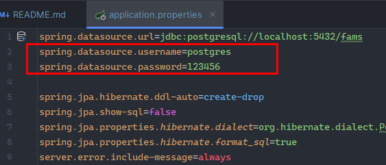

That's it. No npm, no JavaScript frameworks.

Now you can run this project, run `mvn spring-boot:run` and go
to [http://localhost:8080/login](http://localhost:8080/login). You'll see a login page ready to be tested.

## Usage

In order to use the system, **_you must first log in_**.

There are three types of accounts: **_Super admin_**, **_General admin_**, and **_Trainer_**.

Each account type has different permissions and access to different functionalities.

Here are the credentials for the default accounts:

- **_Super admin_**
    - username: `fptfams@gmail.com`
    - password: `fams12345`
- **_General admin_**
    - username: `adfams100@gmail.com`
    - password: `fams12345`
- **_Trainer_**
    - username: `famstrainer@gmail.com`
    - password: `fams12345`

## Project Structure

### MVC Architecture

The project follows a standard MVC structure with separate packages for controllers, models, repositories, and services.

- **controller:** Handles incoming HTTP requests and delegates to the appropriate service.

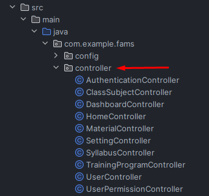

- **model:** Represents the entities used in the system (User, Syllabus, TrainingProgram, Class, etc.).

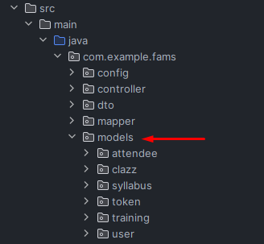

- **repository:** Manages data access and database interactions.

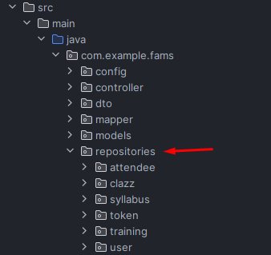

- **service:** Implements business logic and communicates with repositories.

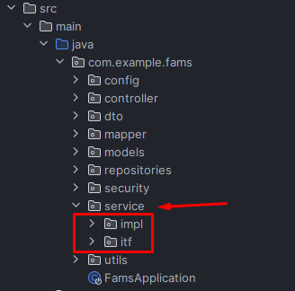

### Thymeleaf & Static Assets

In this project, the Thymeleaf html templates live in the [templates folder](src/main/resources/templates). Spring
Security is configured to block paths with the .html extension, so the raw templates aren't visible to users.

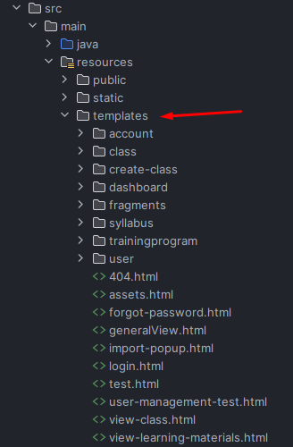

The static assets live in both [public](src/main/resources/public) and [static](src/main/resources/static) folders.

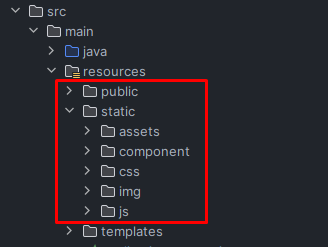

### Spring Security

The project uses Spring Security to handle authentication and authorization. The configuration can be found in
the [SecurityConfig](src/main/java/com/example/fams/config/SecurityConfig.java) class.

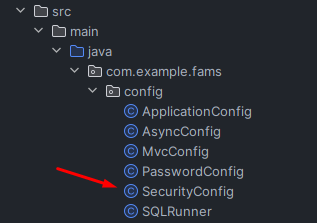

## Screenshots

Here are some screenshots of the system.

We can't show you everything, but you can try it out yourself.

### Login page

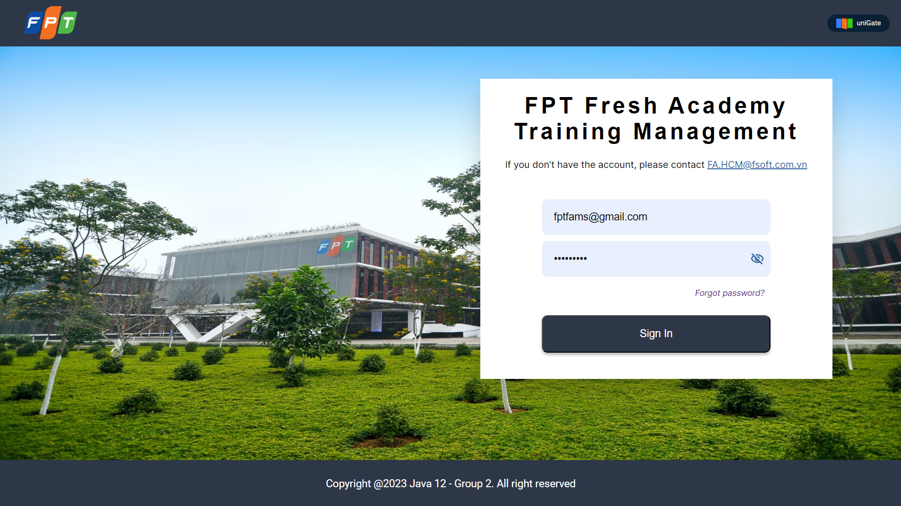

### Home page

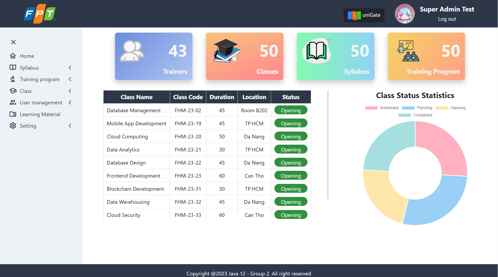

### User management

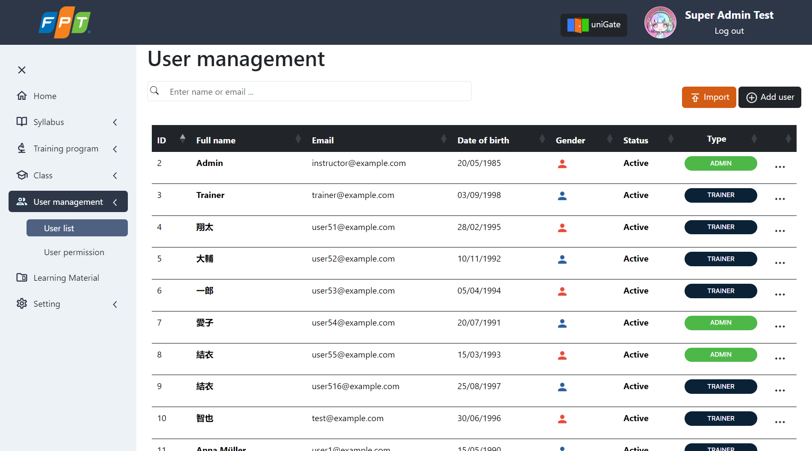

### Syllabus management

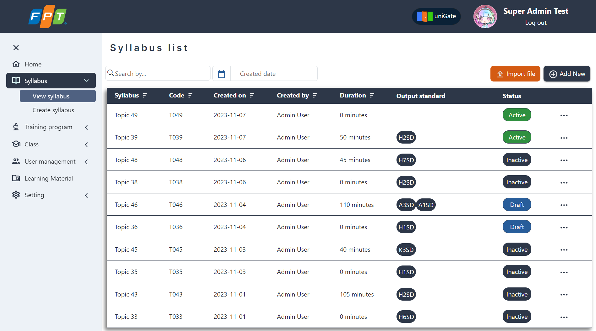

### Training program

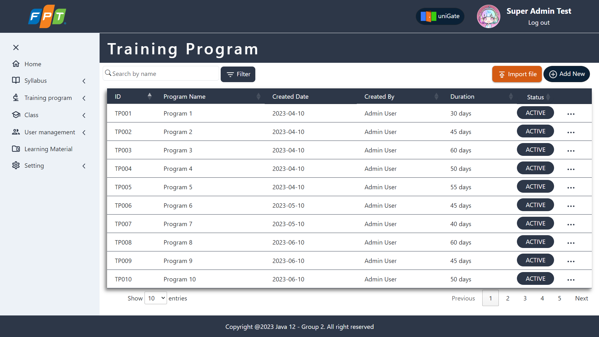

### Class management

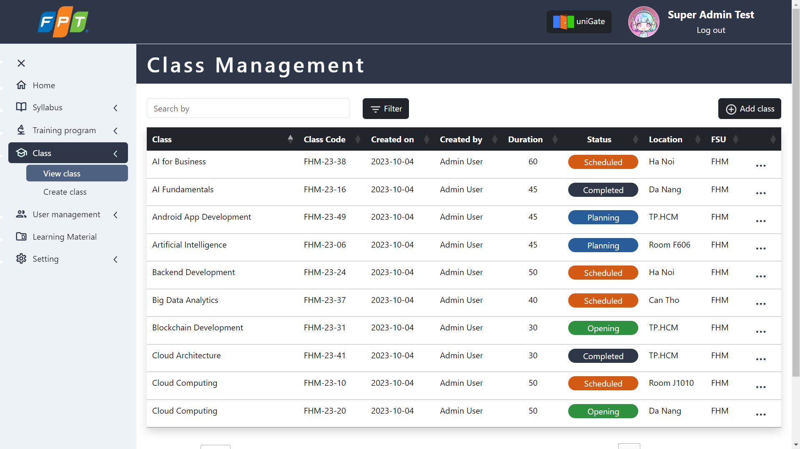

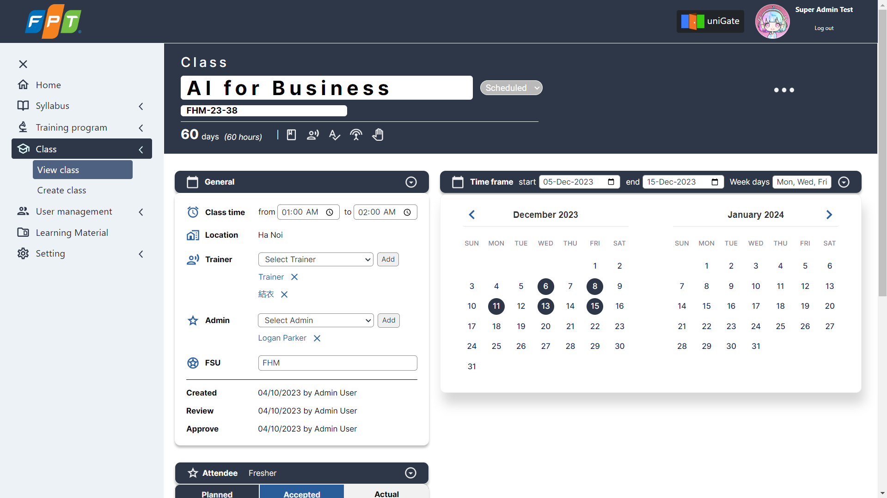

### Account Settings

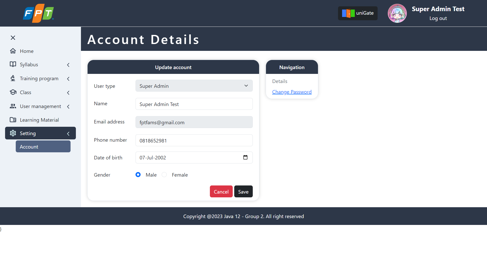

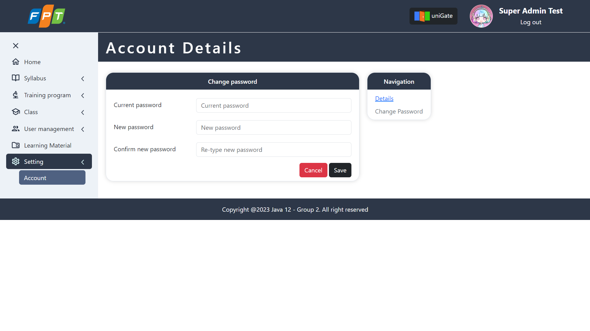

## Contributors

These are Group 2's members those who have contributed to the project.

- **Team 6**
    - Chu Tuấn Kiệt - SE160890
    - Đặng Minh Thắng - SE161126
- **Team 7**
    - Nguyễn Huỳnh Đức Trí - SE162014
    - Phan Song Thảo - SE162032
    - Đào Tiến Phát - SE162060
    - Nguyễn Ngọc Yến Như - SE162057
- **Team 8**
    - Võ Anh Hiếu - SE150765
    - Hồ Hiếu Nghĩa - SE172065
    - Châu Minh Nhật - SE173082
- **Team 9**
    - Trần Gia Thành Đạt - SE161767
    - Trần Nhật Khanh - SE172339
    - Cao Minh Thiên - SE162148
- **Team 10**
    - Lôi Bảo Thông - SE171951
    - Nguyễn Minh Đạt - SE170570
    - Hoàng Tuấn Minh - SE161413
